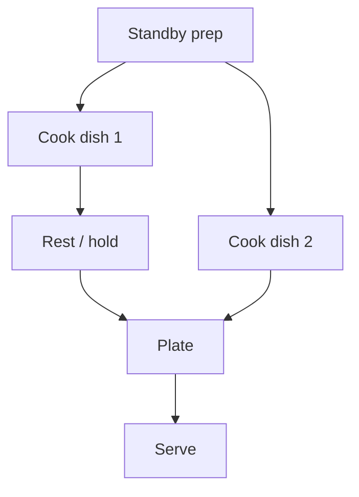

# Manual Output Format

Use this reference whenever the user asks for a cooking manual or detailed execution plan.

## Source Requirements

Every dish in the manual must include:

- source name
- source URL
- original serving count
- retrieved ingredient list
- retrieved method summary
- user adaptation notes

Do not invent dishes. Do not store or quote full source text. Summarize and adapt.

Accept a source only if it provides enough information to recover:

- ingredients
- quantities or a clear serving basis
- cooking sequence
- critical heat/doneness cues, either from the source or standard technique adaptation

For YouTube subtitle-derived recipes, include a short uncertainty note if ingredients were inferred from narration rather than a written list.

## Required Sections

Output in Chinese unless the user requests another language.

### 1. Manual Summary

Include:

- meal scenario
- serving count
- budget target
- total active cooking time
- total elapsed time
- equipment needed
- source list

### 2. Portion And Ingredients Table

Use a Markdown table with these columns:

| Dish | Source | Original Portion | Adapted Portion | Use From Inventory | Buy | Notes |
|---|---|---:|---:|---|---|---|

Rules:

- Keep quantities concrete.
- Mark estimates clearly.
- Split pantry seasonings from items that must be bought.
- If local price was checked, include source/date. If not checked, label as estimate.

### 3. Standby Prep

This section is for work that can be done before final cooking.

Use a Markdown table:

| Time | Task | Detail | Holding Method | Risk |
|---|---|---|---|---|

Examples:

- wash/dry vegetables
- portion meat
- pre-mix sauce
- measure pasta
- chill dessert
- set table

Do not recommend unsafe long room-temperature holding for meat, seafood, dairy, or cooked rice.

### 4. Final Cooking Plan

Use a timed sequence table:

| Clock | Action | Pan/Tool | Heat | Cue To Move On |
|---|---|---|---|---|

Rules:

- Make cross-dish timing explicit.
- Put high-risk steps such as steak, seafood, pasta, and emulsified sauces near serving time.
- Include rest time for meat.
- Include plating order.

### 5. Heat Control

Use a table:

| Dish | Step | Heat | Visual / Sound Cue | Correction |
|---|---|---|---|---|

Common cue vocabulary:

- low heat: small steady bubbles, no aggressive sizzling
- medium heat: steady sizzle, moderate browning
- medium-high heat: clear sizzle, fast browning without smoking
- high heat: rapid sear, short duration, watch closely

If the user has an induction stove, translate heat into relative levels if known. If not known, use low/medium/medium-high/high.

### 6. Mermaid Step Diagram

Include at least one Mermaid flowchart for the whole meal.

Use this pattern:

For meals with parallel work, show parallel branches.

### 7. Optional Mermaid Gantt

Use a Gantt chart when timing matters:

```mermaid
gantt
  title Dinner Execution Timeline
  dateFormat HH:mm
  axisFormat %H:%M
  section Prep
  Wash and cut vegetables :a1, 18:00, 15m
  section Cook
  Start main dish :b1, 18:20, 20m
  section Serve
  Plate and serve :c1, 18:45, 10m
```

Use realistic clock times if the user provides a target serving time. Otherwise use relative labels like T-60, T-45 in tables and a flowchart instead of a Gantt.

### 8. Final Checklist

End with a concise checklist:

- ingredients bought
- prep completed
- cooking order
- plating
- inventory update suggestion

## Quality Bar

A good manual lets the user cook without reopening the source pages.

Minimum quality:

- no missing quantities for core ingredients
- no hidden steps such as "make sauce" without detail
- clear heat level for each pan step
- clear cue for doneness
- realistic timing
- source citations visible

If these cannot be satisfied from the source, say what is missing and ask whether to use a different source.

Keep the manual compact. Prefer one consolidated timing table for the whole meal instead of repeating separate timelines per dish unless the meal is complex.
